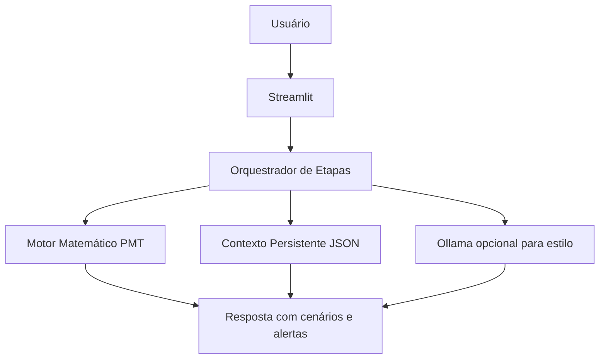

# Jornada dos Sonhos

> Agente conversacional de planejamento financeiro por metas: transforma um sonho em plano matemático com simulação e controles de risco.

## O que é

A `Jornada` pergunta primeiro sobre o objetivo de vida e só depois converte isso em números.

Fluxo principal:
1. Descoberta do sonho em linguagem natural.
2. Estimativa inicial de custo com faixa segura.
3. Coleta de prazo e valor já guardado.
4. Simulação de aporte mensal com juros compostos em dois cenários.

## Diferencial

- Conversa guiada por etapas para evitar respostas soltas.
- Persistência de contexto por usuário em `data/jornada_contexto.json`.
- Choque de realidade com mensagem humanizada quando o aporte fica inviável para a renda.
- Guardrails explícitos para evitar promessa de rendimento e recomendação de ativo.

## Motor de simulação

A aplicação calcula o aporte mensal necessário para atingir a meta (`PMT`) em dois cenários simulados:

- Conservador: `0,5%` ao mês.
- Moderado: `0,8%` ao mês.

O resultado é educativo e comparativo, sem caráter de recomendação financeira.

## Arquitetura



## Como executar

1. Instale dependências:

```bash
pip install streamlit requests
```

2. (Opcional) Ative o Ollama para respostas mais naturais:

```bash
ollama pull gpt-oss
ollama serve
```

3. Rode o app:

```bash
streamlit run src/app.py
```

## Segurança e risco

- O app se declara educativo e não recomenda produtos específicos.
- Entradas inválidas são tratadas antes de calcular.
- O sistema não depende do LLM para a matemática principal.
- Se o LLM falhar, o app responde com fallback determinístico.
- Riscos e mitigações completos: `docs/06-riscos-e-controles.md`.
